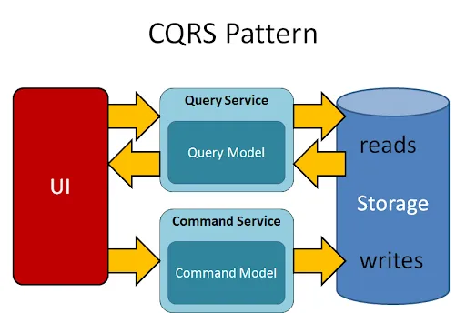
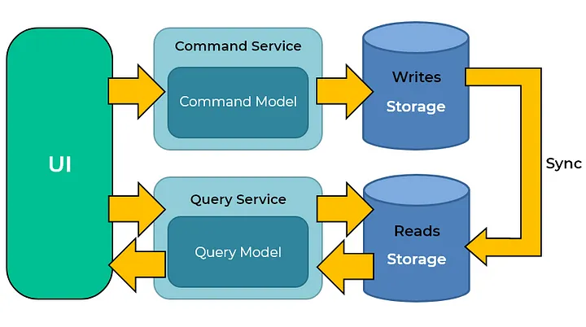
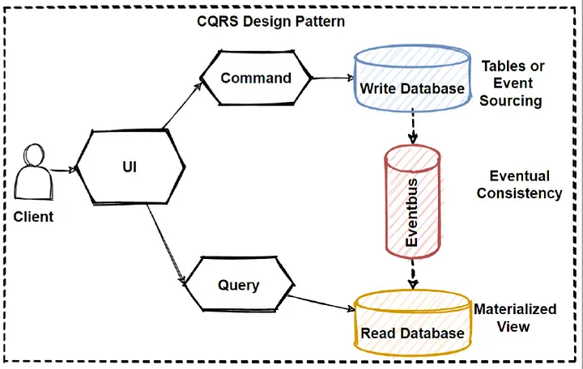

# CQRS

## O que é?

CQRS significa Command and Query Responsibility Segregation, ou seja, Segregação de Responsabilidade de Comando e Consulta. Este padrão é citado por [Greg Young](https://twitter.com/gregyoung) em um [post de 16/02/2010](http://codebetter.com/gregyoung/2010/02/16/cqrs-task-based-uis-event-sourcing-agh/) que já não está mais online, mas está arquivado [aqui](https://gist.github.com/andrzj/d75968e6899dabb8c1ed5c17bb6b14e9).

Primeiramente, CQRS:

- NÃO é uma arquitetura
- NÃO é consistência eventual
- NÃO é "usar eventos"
- NÃO é mensageria
- NÃO é ter Modelos para leitura e escrita
- NÃO é usar Event Sourcing.

Em seu post o autor explica que CQRS é um padrão onde simplesmente se criam dois objetos onde previamente havia um, separando métodos de **comando** e **consulta** (a mesma definição usada no princípio de [CQS](https://martinfowler.com/bliki/CommandQuerySeparation.html) cunhado por Bertrand Meyer em seu livro "Object Oriented Software Construction").

Em outras palavras, ao invés de trabalhar com apenas um modelo para leitura e escrita, separam-se em dois.

CQRS se aplica no objeto da camada de serviço. Por exemplo:

``` Java
CustomerService

void MakeCustomerPreferred(CustomerId) 
Customer GetCustomer(CustomerId) 
CustomerSet GetCustomersWithName(Name) 
CustomerSet GetPreferredCustomers() 
void ChangeCustomerLocale(CustomerId, NewLocale) 
void CreateCustomer(Customer) 
void EditCustomerDetails(CustomerDetails)
```

Se transforme em dois serviços:

``` Java
CustomerWriteService

void MakeCustomerPreferred(CustomerId) 
void ChangeCustomerLocale(CustomerId, NewLocale) 
void CreateCustomer(Customer) 
void EditCustomerDetails(CustomerDetails)

CustomerReadService

Customer GetCustomer(CustomerId) 
CustomerSet GetCustomersWithName(Name) 
CustomerSet GetPreferredCustomers()
```

## Para que serve?

De forma simplificada, se aplica CQRS na aplicação quando existe grande disparidade entre leitura e escrita. Ele permite que sua arquitetura desacople essas duas funções a fim de escalar os serviços de forma independente e aumentar a performance.

Serve para atender sistemas complexos, onde são claras as intenções do usuários dentro da aplicação e isso se traduz em comandos e consultas (Command/Querys), como nos cenários abaixo:

### Escritas (Command)

- Validações complexas
- Regras de negócio complexas
- Orquestrações
- Fluxos assíncronos

### Leituas (Querys)

- Consultas complexas
- Multiplos joins em tabelas
- Múltiplas views
- Agregações entre domínios

-----

| PRÓS              | CONTRAS                  |
|-------------------|--------------------------|
| Maior Performance | Maior Complexidade       |
| Escalabilidade    | Inconsistência de dados  |
| Flexibilidade     | Infraestrutura adicional |
| Mantenabilidade   | Aumento de latência      |
| Modelagem (DDD)   |                          |

## Observações

Modelos de escrita (comando) e leitura (consulta) podem ser separados em processos, serviços ou mesmo infraestruturas diferentes.

Deve-se levar em consideração que, dependendo da implementação (uso de mais de um modelo), a consistência dos dados pode ser eventual.

Frequentemente CQRS é apresentado junto de Event Sourcing, porém eles não devem ser confundidos. CQRS habilita uma série de outras arquieturas, a partir da segregração das resposabilidades.

## Diagramas

### Conceitual

O diagrama abaixo representa o conceito em sua raiz, exibindo a segregação dos modelos.

|            |
| :-------------------------: |
| *Figura 1: CQRS conceitual* |

### Bases de dados distintas

|                            |
| :--------------------------------------------: |
| *Figura 2: Modelos e Bases de dados distintas* |

### Broker e handler de eventos

|                         |
| :-------------------------------------------: |
| *Figura 3: Eventbus e consistência eventual*  |

## Instalação

``` shell
$ npm install

added 400 packages, and audited 401 packages in 26s
found 0 vulnerabilities
```

``` shell
$ npm start

[11:42:05 PM] Starting compilation in watch mode...
[11:42:12 PM] Found 0 errors. Watching for file changes.

[Nest] 2422  - 11/03/2024, 11:42:12 PM     LOG [NestFactory] Starting Nest application...
[Nest] 2422  - 11/03/2024, 11:42:12 PM     LOG [InstanceLoader] ApplicationModule dependencies initialized +22ms
[Nest] 2422  - 11/03/2024, 11:42:12 PM     LOG [InstanceLoader] CqrsModule dependencies initialized +1ms
[Nest] 2422  - 11/03/2024, 11:42:12 PM     LOG [InstanceLoader] HeroesGameModule dependencies initialized +1ms
[Nest] 2422  - 11/03/2024, 11:42:12 PM     LOG [RoutesResolver] HeroesGameController {/hero}: +7ms
[Nest] 2422  - 11/03/2024, 11:42:12 PM     LOG [RouterExplorer] Mapped {/hero/:id/kill, POST} route +14ms
[Nest] 2422  - 11/03/2024, 11:42:12 PM     LOG [RouterExplorer] Mapped {/hero, GET} route +1ms
[Nest] 2422  - 11/03/2024, 11:42:12 PM     LOG [NestApplication] Nest application successfully started +11ms
Application is listening on port 3000.
```

### Testando o CQRS

#### Commands

``` HTTP
POST http://localhost:3000/hero
```

#### Queries

Listando todos os Heróis:

``` HTTP
GET http://localhost:3000/hero
```

## Referências

- [CQRS - Martin Fowler](https://martinfowler.com/bliki/CQRS.html)
- [CQS - Martin Fowler](https://martinfowler.com/bliki/CommandQuerySeparation.html)
- [Greg Young - CQRS, Task Based UIs, Event Sourcing agh!](https://gist.github.com/andrzj/d75968e6899dabb8c1ed5c17bb6b14e9)
- [Udi Dahan - Clarified CQRS](https://udidahan.com/2009/12/09/clarified-cqrs/)
- [The Essence of CQRS](https://medium.com/docplanner-tech/the-essence-of-cqrs-90bdc7ee0980)
- [What The Hell is CQRS?](https://medium.com/@burakatestepe/what-the-hell-is-cqrs-882aff2dfc38)
- [CQRS Software Architecture Pattern: The Good, the Bad, and the Ugly](https://medium.com/@emer.kurbegovic/cqrs-software-architecture-pattern-the-good-the-bad-and-the-ugly-efe48e8dcd14)
- [CQRS Design Pattern in Microservices Architectures](https://medium.com/design-microservices-architecture-with-patterns/cqrs-design-pattern-in-microservices-architectures-5d41e359768c)
